# Data Model Documentation

This project has two independent data stores, owned by two independent bounded
contexts. They are not foreign-keyed to each other at the database level —
the link between them is a plain reference id (see `Document.source_ficha_id`
below) because they live in separate SQLite files.

## 1. Ingestion pipeline (`data/knowledge_base/expedientes.sqlite`)

Owned by `src/infrastructure/persistence/sqlite_repo.py`. A single table,
`documentos`, storing one row per depurated PDF:

| Column | Type | Notes |
|---|---|---|
| `id` | TEXT (PK) | Generated from filename + size (see `IngestUseCase`) |
| `archivo_origen` | TEXT | Original filename |
| `fecha_documento` | TEXT | Extracted by the local LLM, may be null |
| `organismo_emisor` | TEXT | Extracted by the local LLM, may be null |
| `resumen_ejecutivo` | TEXT | Depurated executive summary |
| `fragmentos_clave` | TEXT (JSON array) | Key excerpts, serialized as JSON |
| `nivel_redaccion` | TEXT | Local-LLM's confidence in its own writing quality |
| `confiabilidad_extraccion` | TEXT | `"baja"` flags a document for manual review |
| `idioma_original` | TEXT | Original language of the source document |
| `fecha_ingesta` | TEXT | ISO-8601 UTC timestamp, set automatically |

Corresponds to the `FichaEstructurada` dataclass in `src/core/entities.py`.
This table is not managed by Alembic and is not part of the editorial schema
below.

## 2. Editorial schema (`data/knowledge_base/editorial.sqlite`)

Owned by `src/editorial/infrastructure/persistence/models.py`, managed by
Alembic (`alembic.ini`, `src/editorial/infrastructure/persistence/migrations/`).
Implements the `Document → Story → Chapter → PlatformVersion → PublishRecord`
chain from the `archivo-desclasificado-pipeline` OpenSpec change
(`openspec/changes/archivo-desclasificado-pipeline/design.md`, Decision 3-5).

### Document
An editorial case record: either produced by `research-agent` from a scraped
official source, or referencing a manually-ingested `FichaEstructurada`.

- `id` (PK, string UUID)
- `title`, `agency`, `doc_type` — required
- `published_date`, `source_url`, `extraction_confidence` — optional
- `extracted_text` — required, full text or faithful summary
- `source_ficha_id` — optional; when set, references a row's `id` in the
  ingestion pipeline's `documentos` table (see §1). Not a real foreign key —
  the two tables live in separate SQLite files.
- `created_at`

**Relationships:** one Document has many Stories (cascade delete).

### Story
The narrative generated from a curated Document.

- `id` (PK), `document_id` (FK → `documents.id`)
- `summary` — required
- `narrative_angle` — the curator's note on why the case works as a story (optional)
- `created_at`

**Relationships:** one Story has many Chapters, ordered by `chapter_index` (cascade delete).

### Chapter
One chapter of a Story (a single piece if the story isn't split).

- `id` (PK), `story_id` (FK → `stories.id`)
- `chapter_index` — integer, defines playback/publish order
- `title`, `script`, `source_citation` — required
- `visual_notes` — optional (per-line visual suggestions)
- `created_at`

**Relationships:** one Chapter has many PlatformVersions (cascade delete).

### PlatformVersion
A Chapter adapted for one network, carrying the human-approval status.

- `id` (PK), `chapter_id` (FK → `chapters.id`)
- `platform` — enum: `tiktok`, `instagram`, `x`, `facebook`
- `content` — the adapted text/thread/carousel payload
- `status` — enum: `pending_review` (default), `approved`, `rejected`, `published`, `failed`
- `created_at`, `updated_at`

**Relationships:** one PlatformVersion has many PublishRecords (cascade delete).

> `status` is the structural enforcement of the human-approval gate (design.md
> Decision 5): the publisher never acts on a PlatformVersion whose status
> isn't `approved`.

### PublishRecord
The outcome of one publish/schedule attempt for a PlatformVersion.

- `id` (PK), `platform_version_id` (FK → `platform_versions.id`)
- `scheduled_at`, `published_at` — optional timestamps
- `external_post_id` — the social API's returned post id, for later metrics correlation
- `status` — same enum as PlatformVersion
- `error_message` — set on failure
- `created_at`

### DiscoveredDocument
A checkpoint of one document the research agent successfully scraped,
recorded **before** curation is ever attempted (`research-pipeline-checkpointing`
change) — decouples "found via scraping" from "evaluated by curation" as
two independently-resumable steps, so a curation failure (e.g. an LLM
billing error) never loses already-scraped content. Not foreign-keyed to
`Document` until curation actually advances the case.

- `id` (PK, string UUID)
- `title`, `agency`, `doc_type`, `extracted_text` — required (mirrors the
  scraped document's fields)
- `published_date`, `source_url`, `extraction_confidence` — optional
- `status` — enum: `pending` (scraped, not yet curated), `advanced`
  (curation succeeded, `document_id` set), `discarded` (curation ran and
  scored below threshold — a final outcome), `failed` (curation raised —
  retryable via `POST /research/resume`)
- `error_message` — set when `status = failed`, the exception's message;
  **retained even after a later successful retry** — an audit-trail record
  of the original failure, not cleared on recovery
- `narrative_angle` — set when curation advances the case
- `document_id` — optional FK → `documents.id`, set once `status = advanced`
- `created_at`, `updated_at`

**Relationships:** none cascading — a `DiscoveredDocument` row is never
deleted; it is a permanent checkpoint/audit record, updated in place as its
`status` progresses.

## Entity Relationship Diagram (editorial schema)

```mermaid
erDiagram
    Document {
        string id PK
        string title
        string agency
        string doc_type
        string published_date
        string source_url
        string extracted_text
        string extraction_confidence
        string source_ficha_id
        datetime created_at
    }
    Story {
        string id PK
        string document_id FK
        string summary
        string narrative_angle
        datetime created_at
    }
    Chapter {
        string id PK
        string story_id FK
        int chapter_index
        string title
        string script
        string visual_notes
        string source_citation
        datetime created_at
    }
    PlatformVersion {
        string id PK
        string chapter_id FK
        string platform
        string content
        string status
        datetime created_at
        datetime updated_at
    }
    PublishRecord {
        string id PK
        string platform_version_id FK
        datetime scheduled_at
        datetime published_at
        string external_post_id
        string status
        string error_message
        datetime created_at
    }

    DiscoveredDocument {
        string id PK
        string title
        string agency
        string doc_type
        string published_date
        string source_url
        string extracted_text
        string extraction_confidence
        string status
        string error_message
        string narrative_angle
        string document_id FK
        datetime created_at
        datetime updated_at
    }

    Document ||--o{ Story : "generates"
    Story ||--o{ Chapter : "splits into"
    Chapter ||--o{ PlatformVersion : "adapted as"
    PlatformVersion ||--o{ PublishRecord : "publish attempts"
    DiscoveredDocument |o--o| Document : "advances into (once curated)"
```

## Status

All six editorial tables exist and are covered by
`tests/unit/test_editorial_models.py` and `tests/unit/test_editorial_migrations.py`
(`discovered_documents` added by the `research-pipeline-checkpointing`
change, migration `0002_discovered_documents`). The full chain is live end
to end:

- `orchestrator.run_research_cycle` (Phases 3-4) persists a
  `Document`/`Story`/`Chapter`/`PlatformVersion` chain via
  `approval_gate.persist_story`, every `PlatformVersion` starting at
  `status = pending_review`.
- `PublishingUseCase` (Phase 5) writes `PublishRecord` rows the moment a
  `PlatformVersion` is approved — see `approval_gate.run_if_approved`.
- The Phase 6 admin panel (`frontend/`) reads this schema through
  `GET /chapters/pending` (pending items with full context),
  `GET /publish-records` (the calendar view), and `GET`/`PATCH /cases`
  (which reads/edits `casos_cubiertos.md`, not this SQL schema).
- `orchestrator.run_research_cycle` (`research-pipeline-checkpointing`)
  writes a `DiscoveredDocument` row immediately after a document is
  scraped, before curation runs; `run_resume_cycle` re-processes every
  `pending`/`failed` row without re-scraping. The admin panel reads
  `GET /research/checkpoints/summary` to show the Pipeline feed's
  "documentos pendientes/fallidos" banner and triggers
  `POST /research/resume` from its "Reanudar pipeline" button.
